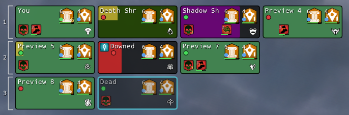
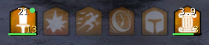

# GW2 Unit Frames

Highly customizable party/squad unit frames and personal buff bars for [Guild Wars 2](https://www.guildwars2.com/), built as an [ArcDPS](https://www.deltaconnected.com/arcdps/) addon.

[](https://ko-fi.com/H4V823JQJO)

I built this mainly for myself and my friends. If it helps you out too and you feel like tipping, that would mean a lot.

**Version:** 2.4.0

[](https://github.com/michael-stubbs/GW2-UnitFrames/releases/latest)
[](https://discord.com/users/65958441679593472)

## Preview

Party / squad unit frames (HP, barrier, shrouds, downed, boons & conditions):



Personal buff bar (stacks, timers, progress, source dots):



## Requirements

- Windows x64
- Guild Wars 2 (64-bit)
- [ArcDPS](https://www.deltaconnected.com/arcdps/) (ImGui **1.92.7**)
- [ArcDPS Unofficial Extras](https://github.com/Krappa322/arcdps_unofficial_extras_releases) — **required** for party/squad unit frames (join/leave and subgroup tracking)

**Nexus is not required.** This is a normal ArcDPS addon. It works with stock ArcDPS (`d3d11.dll` in `bin64`) or with ArcDPS loaded through [Nexus](https://raidcore.gg/Nexus) / other hosts — whatever you already use to run ArcDPS plugins.

## Install (release build)

1. Grab the latest `gw2-unitframes.dll` from [Releases](https://github.com/michael-stubbs/GW2-UnitFrames/releases/latest) (or use the **Release** badge above).
2. Close Guild Wars 2 completely (`Gw2-64.exe` must not be running).
3. Copy `gw2-unitframes.dll` next to where ArcDPS loads plugins.
   - Common setups: `Guild Wars 2\bin64\` (same folder as `Gw2-64.exe` / `d3d11.dll` / ArcDPS).
   - Some loaders (including Nexus) use `addons\arcdps\` — put the DLL wherever your ArcDPS already loads other addons.
   - If you still have an older `arcdps_buffbar.dll`, remove it so only one copy loads.
4. Launch the game. Open the ArcDPS options window and find the **GW2 Unit Frames** tab.

## Usage (quick start)

1. Set overlay mode to **On** in the GW2 Unit Frames options tab (under ArcDPS Options -> Extensions).
2. First launch creates a **Boons** bar with all 12 boons pinned.
3. Options → Pins: add by ID, **Pin all boons**, reorder with `^` / `v`, open **Known Effects**.
4. Enable **Party / Squad frames** for ally vitals (requires Unofficial Extras).
5. Customize **Party / Squad frames** using the extension options panel.
6. Optional **experimental** features (off by default; see Options → EXPERIMENTAL): hard-CC indicators and range dots on party frames.

## About

Personal buff bars and party/squad frames with live timers, stacks, and vitals. Buff and unit-frame data is read from client memory where available, with ArcDPS combat events as a fallback for personal bars.

Inspired by the original [x4c1/arcdps_buffbar](https://github.com/x4c1/arcdps_buffbar) concept. Credit to [x4c1](https://github.com/x4c1) for the BuffBar idea and design.

### Updates

ArcDPS can auto-update this addon when a newer GitHub release is available.

**Replacing the DLL file on an existing release does not trigger an update** for players already on that tag — version comparison is by release tag, not by file hash or upload time. Publish a **new release with a higher version tag** (e.g. `v2.3.4`) so auto-update can see it.

You can always update manually by replacing the DLL from Releases (game closed). First install of a build that includes auto-update (2.3.1+) is still manual if you are coming from an older DLL.

Settings and icon cache live under:

```text
<GW2>\addons\arcdps_buffbar\
  arcdps_buffbar.ini
  cache\
  debug.log          (only if enabled in options)
```

## ArenaNet third-party policy & game data

ArenaNet’s [Policy: Third-Party Programs](https://help.guildwars2.com/hc/en-us/articles/360013625034-Policy-Third-Party-Programs) asks whether a tool lets someone play faster, better, longer, or more accurately than without it, play unattended, or gain undeserved rewards. This addon is an **informational overlay**: it does not automate input, play for you, or change combat outcomes. It rearranges or highlights information that is already available in the stock UI and/or clearly visible in the world.

ArenaNet does **not** review, approve, or endorse third-party programs. Use is at your own risk; the notes below are our design intent, not a guarantee of permissibility.

| Game data shown / used | Source | Why we believe this stays within the policy (notes) |
|------------------------|--------|-----------------------------------------------------|
| Party / squad membership, names, subgroups | Unofficial Extras (preferred); ArcDPS agents (fallback) | Same roster the stock party/squad UI already shows; used only to decide **who** gets a frame and how to group them. |
| Ally / self HP, barrier, alive / downed / dead | Client memory (Character vitals) | Already on personal and party frames; overlay is a customizable presentation of the same vitals, not hidden state. |
| Self buffs / conditions (pinned bars: stacks, timers, progress) | Memory BuffBar (primary); ArcDPS combat stream (fallback / sources) | Same effects as the stock buff/condition bar; layout and timers are convenience, not new combat information. |
| Selected ally effects on frames (Stability, Resistance; optional Immobile / Chilled / Weakness / Fear) | Memory BuffBar on that ally | Those icons already exist in-game on the player and (for common boons) on party UI. Tracking a short allow-list is a denser party view of **already-applied** effects, not prediction or enemy scouting. |
| Necro / Specter shroud tint on HP bar | Memory (shroud effect IDs) | Shroud is obvious on the character model and self UI; tint mirrors that state for allies you can already see transforming. |
| Profession / elite specialization | MumbleLink; ArcDPS agents; memory (prof) | Shown on stock party frames and character select; white wiki icons are cosmetic only. |
| Content type (PvE / sPvP / WvW) for profile auto-switch | MumbleLink map type | Same mode you are already playing; only switches **your** saved layout profile. |
| In-combat flag (optional hide buff bars out of combat) | ArcDPS enter/exit combat on self | Matches the game’s own combat state; does not automate skills. |
| Effect / profession icons | Cached wiki / GW2 API art | Cosmetic; same public art the game and wiki use. |
| **Range dots** (ally in/out of a skill-range threshold, default 1200) | MumbleLink self position + ally world position from memory | Distance is already inferable by looking at allies in the world and by skill range rings / casting feel. The dot is a quick party-frame readout of that **visible** spacing, not wallhacks or fog-of-war reveal — allies must already be on your roster and resolvable in client state. Toggleable / limit configurable. |
| **Hard CC wash** (stun / knockdown / pull / launch / float; stunbreak clear) | Memory BuffBar (stun/daze/KD); live combat messaging for pull/launch/etc. | Control effects are visible in the world and on the affected player’s UI. The wash mirrors that **already-applied** state on party frames and clears when control returns. Toggleable (experimental). |
| Buff **source** dots (self vs other) | ArcDPS combat events | Convenience for “who applied this”; does not automate reapplication or change targeting. |

## Stability notes

- **Memory reads** (self buffs, ally HP/barrier/buffs) depend on Guild Wars 2 client layout. A game patch can break them until the addon is updated. Personal bars can still use ArcDPS combat data as a fallback when memory is unavailable.
- Icon downloads need network access on first use; results are cached under `addons\arcdps_buffbar\cache\`.
- Keep ImGui in sync with your ArcDPS build (this release targets **1.92.7**).

## Troubleshooting

Windows Defender sometimes flags the release DLL as **`Trojan:Win32/Sabsik.TE.A!ml`** (or similar). The `!ml` suffix is a machine-learning heuristic, not a known malware signature — common for unsigned ArcDPS/game overlays that read process memory. A false-positive report has been [submitted to Microsoft](https://www.microsoft.com/en-us/wdsi/filesubmission). Until definitions update: restore/allow the file in Defender, and download only from [GitHub Releases](https://github.com/michael-stubbs/GW2-UnitFrames/releases).

| Symptom | What to try |
|---------|-------------|
| Addon missing from ArcDPS | DLL in the wrong folder; GW2 still running during copy |
| Blank / wrong buffs | Enable **Write debug.log** under Advanced, reproduce, check `addons\arcdps_buffbar\debug.log` |
| Unit frames empty / wrong party | Install [Unofficial Extras](https://github.com/Krappa322/arcdps_unofficial_extras_releases); join a party/squad |
| Icons missing | Clear icon cache in options; check firewall / first-run downloads |
| Crash after GW2 patch | Update GW2 Unit Frames; if memory reads fail, wait for an addon update |
| Defender quarantines the DLL (`Sabsik…!ml`) | False positive — restore/allow the file; wait for Microsoft’s definition update after the developer submission |

## License

See [LICENSE](LICENSE). In short: the addon is **closed source** and free to use
from official [GitHub Releases](https://github.com/michael-stubbs/GW2-UnitFrames/releases);
source code is not published.

Guild Wars 2 and all related assets are trademarks of ArenaNet / NCSOFT. This project is not affiliated with ArenaNet or NCSOFT. ArcDPS is by deltaconnected.

[](https://github.com/michael-stubbs/GW2-UnitFrames/releases)
